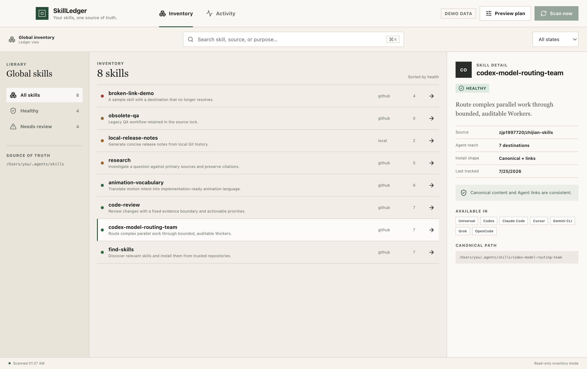

# SkillLedger

> Your skills, one source of truth.

[](https://github.com/terrytan95/skillledger/actions/workflows/ci.yml)
[](LICENSE)
[](#development)

SkillLedger is a local-first desktop control plane for global Agent Skills. It inventories the canonical `~/.agents/skills` library, traces each skill to its source and Agent destinations, and surfaces drift before anything touches disk.



## Why SkillLedger

Installing a skill is the easy part. Maintaining the same skill across multiple coding agents raises harder questions:

- Which copy is canonical?
- Where did it come from?
- Which agents use a link, an independent copy, or nothing at all?
- Has a destination drifted or broken?
- What will a repair change, and can it be rolled back?

SkillLedger is built around that maintenance loop. The current foundation performs real, read-only discovery; reconciliation remains preview-only until the operation journal and rollback path are complete.

## What works today

- Scans `~/.agents/skills` as the canonical library.
- Reads provenance from the optional `~/.agents/.skill-lock.json`.
- Inspects Codex, Claude Code, Cursor, Gemini CLI, Grok, OpenCode, and AiderDesk skill directories.
- Distinguishes healthy links, independent copies, missing canonical content, and broken symlinks.
- Provides search, health filters, inventory groups, source details, and Agent reach in the selected Ledger interface.
- Previews a reconciliation plan without enabling unsafe writes.
- Uses representative demo data when the renderer runs in a normal browser.

| Health | Meaning |
| --- | --- |
| Healthy | Canonical content and Agent links are consistent. |
| Review | Content exists, but provenance is missing or an independent copy may drift. |
| Missing | The source lock tracks a skill that is absent from the canonical library. |
| Broken | A destination link is invalid or points somewhere unexpected. |

## How it works

```text
Ledger interface
  └─ typed contextBridge API
       └─ validated Electron IPC
            └─ inventory scanner
                 ├─ ~/.agents/skills
                 ├─ ~/.agents/.skill-lock.json
                 └─ Agent-specific skill directories
```

The renderer has no direct filesystem or Node.js access. Discovery lives in a small inventory module that can be tested without Electron.

Future writes follow one rule:

```text
scan → hash → plan → preview → journal → apply → verify → rollback
```

If a plan's preconditions change, the plan must be regenerated rather than applied against stale state.

## Development

Requirements:

- macOS
- Node.js 22.12 or newer
- Yarn 1.x

```bash
git clone https://github.com/terrytan95/skillledger.git
cd skillledger
yarn install
yarn dev
```

Run the full local verification:

```bash
yarn typecheck
yarn test
yarn build:app
```

Create an unsigned local macOS application bundle:

```bash
yarn package
```

The bundle is written under `release/<version>/`.

## Project structure

```text
electron/
  main.ts                 Window policy and validated IPC
  preload.ts              Minimal renderer bridge
  skill-inventory.ts      Filesystem discovery and health rules
src/
  App.tsx                 Ledger workflow and interaction state
  App.css                 Ledger visual system
  types.ts                Shared renderer/main contracts
docs/
  ARCHITECTURE.md         Runtime boundaries and safe mutation model
  PRODUCT.md              Scope, roadmap, and success measures
```

## Roadmap

- [x] Canonical library and Agent destination discovery
- [x] Provenance-aware health classification
- [x] Ledger interface and safe plan preview
- [ ] Content hashes and drift details
- [ ] Deterministic dry-run plans
- [ ] Append-only operation journal
- [ ] Atomic apply, verification, and rollback
- [ ] GitHub update checks and pinned versions
- [ ] Reproducible inventory export and restore

## Security

- Local-first: no account, telemetry, or hosted service.
- Electron context isolation and renderer sandbox are enabled.
- Renderer navigation and new windows are denied.
- IPC exposes one narrow scan method and validates its sender.
- Filesystem mutation will not ship without preview, journaling, verification, and rollback.

Please report vulnerabilities through the repository's private GitHub Security Advisories. See [SECURITY.md](SECURITY.md).

## Contributing

Keep changes narrow, preserve the renderer/main security boundary, and add one focused check for non-trivial inventory rules. See [CONTRIBUTING.md](CONTRIBUTING.md).

## License

[MIT](LICENSE)
